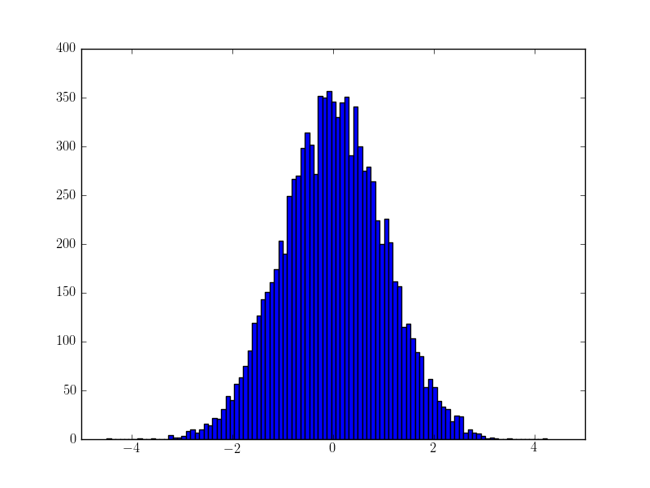
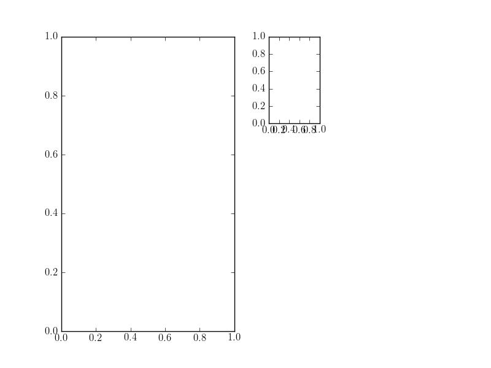
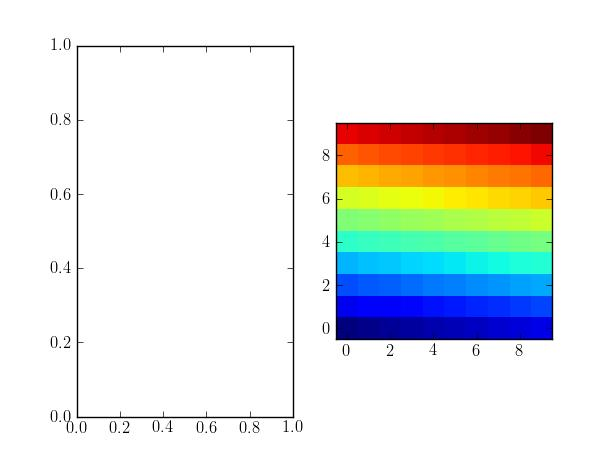
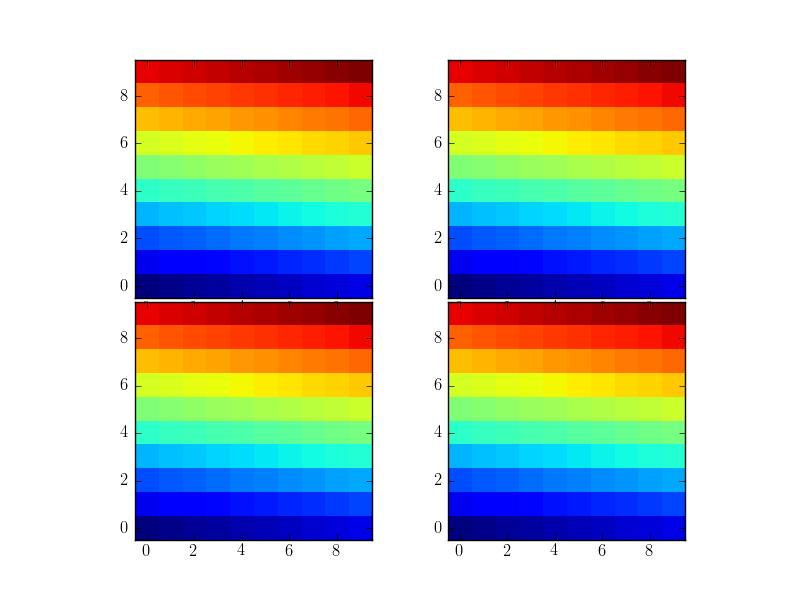
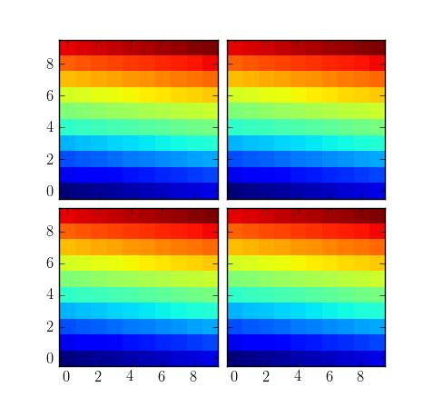
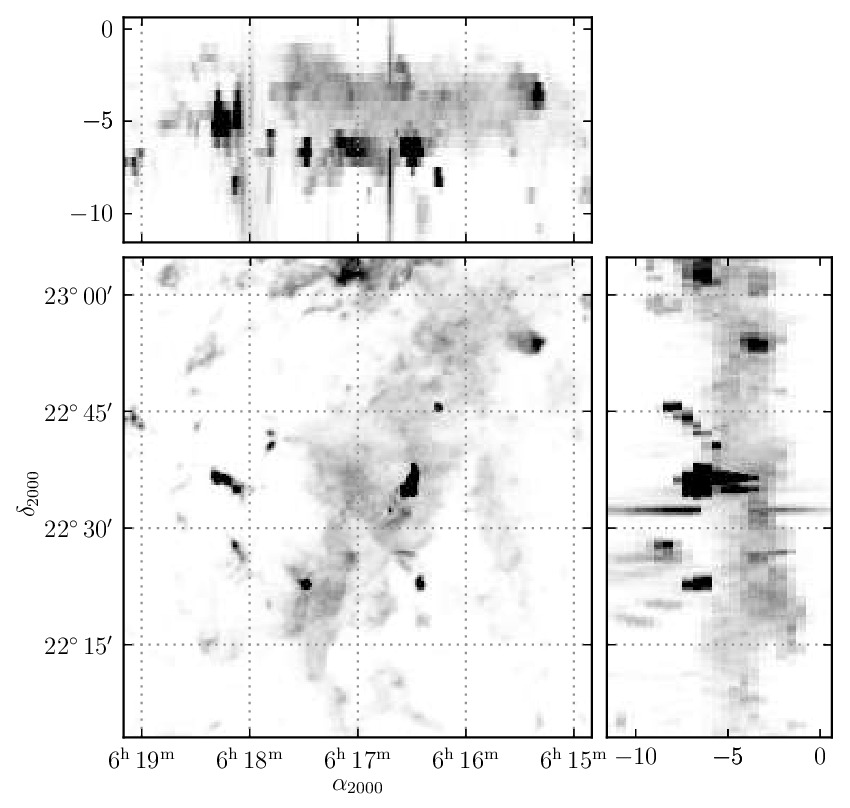
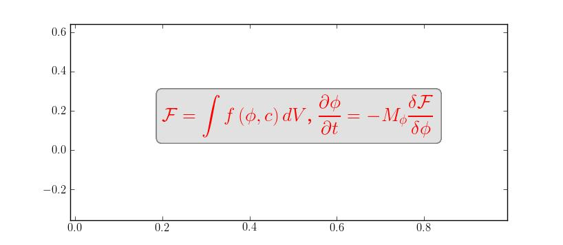
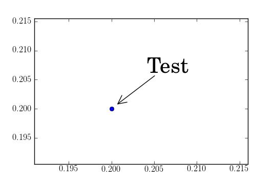
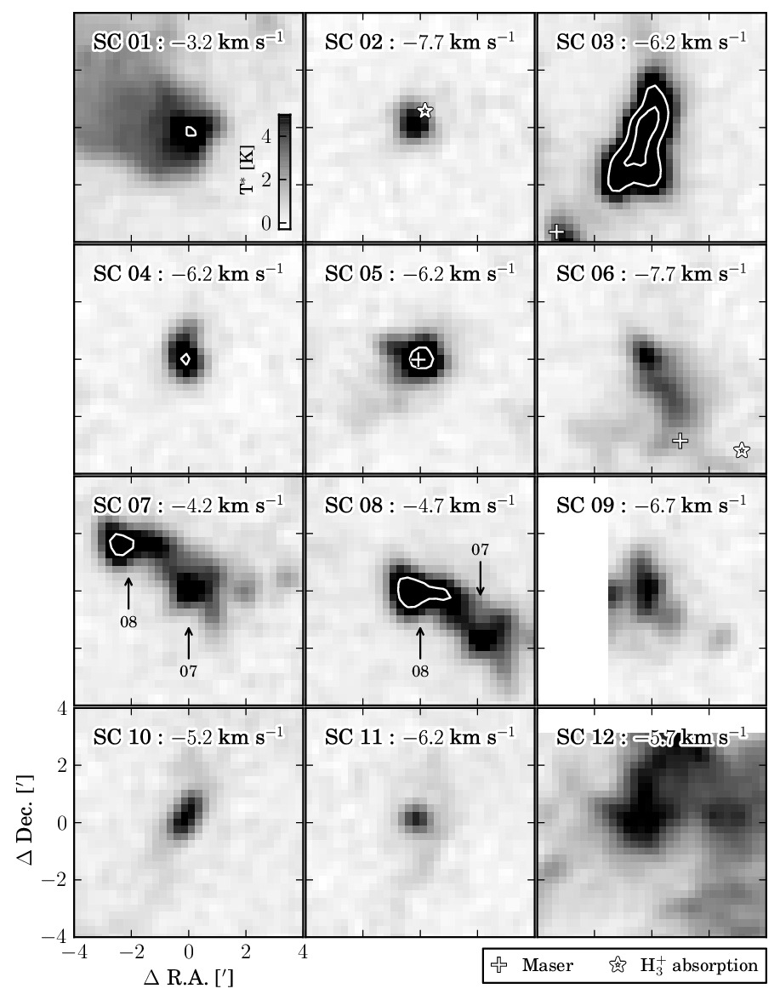

Publication quality figures w/ Matplotlib
=========================================

----

http://goo.gl/SOMbY
===================

----

Publication quality figures w/ Matplotlib
-----------------------------------------

.. image:: http://leejjoon.github.com/pywcsgrid2/images/image.jpg
   :height: 600

----

matplotlib : a python 2D plotting library
=========================================

----

Matplotlib
----------

- A python 2D plotting library that produces publication quality figures 

 - in a variety of hardcopy formats (ps, pdf, svg, png, etc)
 - and interactive environments (gtk, tk, qt, wx, html5, etc)
 - across platforms (linux&unix, mac os X, windows). 

- When integrated with ipython, provides a powerful interactive environment (ala MATLAB® or Mathematica®).

----

matplotlib tries to make easy things easy and hard things possible!
===================================================================

----

.. code-block:: python

    x = randn(10000)
    hist(x, 100)

----

.. image:: http://matplotlib.sourceforge.net/plot_directive/mpl_examples/pylab_examples/finance_demo.hires.png
   :height: 400

----

.. image:: http://matplotlib.sourceforge.net/plot_directive/mpl_examples/pylab_examples/boxplot_demo2.hires.png
   :height: 400

----

.. image:: http://matplotlib.sourceforge.net/plot_directive/mpl_examples/pylab_examples/finance_work2.hires.png
   :height: 400

----

.. image:: http://leejjoon.github.com/matplotlib_astronomy_gallery/plot_directive/lbvs/fig_lbvs.hires.png
   :height: 400

----

.. image:: http://leejjoon.github.com/matplotlib_astronomy_gallery/plot_directive/tycho/tycho_hst_kpno_01.hires.png
   :height: 400

----

.. image:: http://leejjoon.github.com/matplotlib_astronomy_gallery/plot_directive/cfasurvey/cfa_survey.hires.png
   :height: 400

----

.. image:: http://leejjoon.github.com/matplotlib_astronomy_gallery/plot_directive/healpix/allsky_galactic_proj_06.hires.png
   :height: 400

----

RTFM
====

Read The **Fine** Manual

----

Matplotlib design
=================

The matplotlib code is conceptually divided into three parts:

- backends : drawing devices, aka renderers, that transform the frontend representation to hardcopy or a display device (ps, pdf, etc.)

- frontend (matplotlib API) : set of classes that do the heavy lifting, creating and managing figures, text, lines, plots and so on. This is an abstract interface that knows nothing about output. 

- pylab interface : the set of functions which allow the user to create plots with code quite similar to MATLAB

----

Backends
========

An abstract base class to handle drawing/rendering operations.
--------------------------------------------------------------

The following methods must be implemented in the backend
---------------------------------------------------------

- draw_path
- draw_image
- draw_text (from v1.0, draw_tex is now optional)
- get_text_width_height_descent

Matpotlib is vector-vased drawing library
-----------------------------------------

The following methods should be implemented in the backend for optimization reasons
-----------------------------------------------------------------------------------

- draw_markers
- draw_path_collection
- draw_quad_mesh

----

Frontends : APIs
================

Artists : Object who renders into a Figure
------------------------------------------

- texts
- lines (with markers)
- patches (e.g., rectangles in histogram)
- images
- collections
- etc.

----

What does draw() do?
====================

- create a renderer if not exists

- call Figure.draw(renderer)

  - call Axes.draw(renderer) for axes instances in Figure.axes.

    - update the axes location accounting the aspect.

    - call Artist.draw(renderer) for artists in the axes

      - update artist 

      - create a GC (color, line width etc.)

      - draw using the renderer (e.g., Renderer.draw_path)

----

.. code-block:: python

    def draw(self, renderer):
        'Draw the :class:`Patch` to the given *renderer*.'
        if not self.get_visible(): return

        renderer.open_group('patch', self.get_gid())
        gc = renderer.new_gc()

        gc.set_foreground(self._edgecolor, isRGB=True)

        lw = self._linewidth
        if self._edgecolor[3] == 0:
            lw = 0
        gc.set_linewidth(lw)
        gc.set_linestyle(self._linestyle)

	# ....

        path = self.get_path()
        transform = self.get_transform()
        tpath = transform.transform_path_non_affine(path)
        affine = transform.get_affine()

	# may use path_effects ..
	renderer.draw_path(gc, tpath, affine, rgbFace)

        gc.restore()
        renderer.close_group('patch')

----

Pylab interface
===============

MATLAB-like environments

----

Figure
======

A figure in matplotlib means the whole window in the user interface.
--------------------------------------------------------------------

Within this figure, there can be axes.
--------------------------------------

- subplot is an axes who positions in a regular grid
- axes allows free placement within the figure

Axes positions are specified in normalized figure coordinate
------------------------------------------------------------

- axes([left, bottom, width, height])
- axes([0.1, 0.1, 0.8, 0.8])

----

GridSpec : advanced subplot
===========================

See http://matplotlib.sourceforge.net/users/gridspec.html

.. code-block:: python

    import matplotlib.gridspec as gridspec

    gs = gridspec.GridSpec(3, 3)

    ax1 = plt.subplot(gs[0, :])
    ax2 = plt.subplot(gs[1,:-1])
    ax3 = plt.subplot(gs[1:, -1])
    ax4 = plt.subplot(gs[-1,0])
    ax5 = plt.subplot(gs[-1,-2])

.. image:: http://matplotlib.sourceforge.net/plot_directive/users/plotting/examples/demo_gridspec02.hires.png
   :height: 300

----

Embedded subplots
-----------------

.. code-block:: python

    from matplotlib.gridspec import GridSpec, GridSpecFromSubplotSpec

    gs = GridSpec(1,2)
    ax1 = plt.subplot(gs[0])

    gs1 = GridSpecFromSubplotSpec(3, 3, subplot_spec=gs[1])
    ax2 = plt.subplot(gs1[0])

----

Axes w/ a fixed aspec ratio
===========================

Axes positions are specified in normalized figure coordinate
------------------------------------------------------------

- This is good for interactive mode.

- But for axes with fixed aspect ratio, it's difficult to control the
  spacing between axes.

----

.. code-block:: python

    fig, ax_list = subplots(2,2)

    arr = np.arange(100).reshape((10,10))

    for ax in ax_list.flat:
        ax.imshow(arr)

    plt.subplots_adjust(wspace=0.02, hspace=0.02)

----

mpl_toolkits.axes_grid1
=======================

http://matplotlib.sourceforge.net/mpl_toolkits/axes_grid/index.html#toolkit-axesgrid-index

.. code-block:: python

   from mpl_toolkits.axes_grid1 import ImageGrid

   fig = plt.figure(1)
   grid = ImageGrid(fig, 111, # similar to subplot(111)
                    nrows_ncols = (2, 2), # creates 2x2 grid of axes
                    axes_pad=0.1, # pad between axes in inch.
                    )
   for ax in grid: # sequence-like interface for axes in the grid
      ax.imshow(arr)

----

.. image:: http://matplotlib.sourceforge.net/plot_directive/mpl_toolkits/axes_grid/examples/demo_axes_grid.hires.png
   :height: 350

----

----

.. image:: http://matplotlib.sourceforge.net/plot_directive/mpl_toolkits/axes_grid/examples/inset_locator_demo2.hires.png
   :height: 400

----

tight_layout & savefig w/ bbox_inches="tight"
---------------------------------------------

-
- new in mpl v1.1

.. code-block:: python

    plt.plot([0, 1], [0, 1], "-")
    plt.tight_layout()
 
    plt.gca().set_aspect(1)
    plt.tight_layout()
    plt.savefig("a.png", bbox_inches="tight")

----

Path
====

http://matplotlib.sourceforge.net/users/path_tutorial.html#path-tutorial

.. image:: http://matplotlib.sourceforge.net/_images/9f2e84e526.png
   :height: 500

----

http://matplotlib.sourceforge.net/examples/pylab_examples/dolphin.html

.. image:: http://matplotlib.sourceforge.net/plot_directive/mpl_examples/pylab_examples/dolphin.hires.png
   :width: 550

----

Text & TeX
==========

matplotlib support TeX rendering (using TeX)
--------------------------------------------

.. code-block:: python

    tex_string = r'$\displaystyle \mathcal{F} = \int f\left( \phi, c \right)' \
                 r'dV$, $\displaystyle\frac{ \partial \phi } { \partial t }' \
                 r'= -M_{ \phi } \frac{ \delta \mathcal{F} }' \
                 r'{ \delta \phi }$'

    bbox_props = dict(boxstyle="round", fc="0.9", ec="0.5", alpha=0.9)

    plt.text(0.2, 0.15, tex_string,
             {'color' : 'r', 'fontsize' : 20},
             bbox=bbox_props)

----

Annotation
==========

http://matplotlib.sourceforge.net/users/annotations_guide.html

Box around Text
---------------

.. image:: http://matplotlib.sourceforge.net/_images/fancybox_demo2.png
   :height: 400

----

.. image:: http://matplotlib.sourceforge.net/_images/annotate_text_arrow.png
   :height: 400

----

Annotation w/ Arrows
--------------------

.. code-block:: python

    plt.plot([0.2], [0.2], "o")
    ann = plt.annotate("Test",
                       xy=(0.2, 0.2), xycoords='data',
                       xytext=(50, 50), textcoords='offset points',
                       arrowprops=dict(arrowstyle="->", shrinkB=10,
                                       connectionstyle="angle3"),
                       size=30
                       )

annoation are dragable.

.. code-block:: python

    ann.dragable()

----

.. image:: http://matplotlib.sourceforge.net/plot_directive/mpl_examples/pylab_examples/fancyarrow_demo.hires.png
   :height: 500

----

.. image:: http://matplotlib.sourceforge.net/plot_directive/mpl_examples/pylab_examples/annotation_demo2_00.hires.png
   :height: 450

----

.. image:: http://matplotlib.sourceforge.net/plot_directive/mpl_examples/pylab_examples/annotation_demo2_01.hires.png
   :height: 450

----

Text as path
------------

- http://matplotlib.sourceforge.net/examples/pylab_examples/demo_text_path.html

.. image::  http://matplotlib.sourceforge.net/plot_directive/mpl_examples/pylab_examples/demo_text_path.hires.png
   :height: 500

----

patheffects
-----------

- override draw_path method of the backends

.. code-block:: python

    from matplotlib.patheffects import withStroke
    imshow([[1,2],[2,3]], interpolation="bilinear")
    txt = annotate("test", (1., 1.), (0., 0),
                   arrowprops=dict(arrowstyle="->",
                                   connectionstyle="angle3", lw=2),
                   size=20, ha="center")
    txt.set_path_effects([withStroke(linewidth=3, foreground="w")])
    txt.arrow_patch.set_path_effects([withStroke(linewidth=5, foreground="w")])

.. image::  http://matplotlib.sourceforge.net/_images/patheffect_demo.png
   :width: 700

----

Legend
======

- legend of complex plots : new in v1.1
- `example <http://matplotlib.sourceforge.net/rc/v1.1.0rc1/examples/pylab_examples/legend_demo4.html>`_

.. image :: http://matplotlib.sourceforge.net/rc/v1.1.0rc1/mpl_examples/pylab_examples/legend_demo4.hires.png
   :height: 400

- http://matplotlib.sourceforge.net/users/legend_guide.html

----

- http://matplotlib.sourceforge.net/users/legend_guide.html#legend-location

- use **bbox_to_anchor** and **bbox_transform** parameters to adjust the legend location.

.. image::  http://matplotlib.sourceforge.net/plot_directive/users/plotting/examples/simple_legend01.hires.png
   :height: 450

----

OffsetBox
---------

- can be used for artists w/ mixed coordinate systems

  - size : data transform
  - position : normalized axes transform

- http://matplotlib.sourceforge.net/examples/axes_grid/simple_anchored_artists.html

.. image:: http://matplotlib.sourceforge.net/plot_directive/mpl_examples/axes_grid/simple_anchored_artists.hires.png
   :height: 400

----

Inset Axes
==========

- http://matplotlib.sourceforge.net/examples/axes_grid/inset_locator_demo.html

.. image:: http://matplotlib.sourceforge.net/plot_directive/mpl_examples/axes_grid/inset_locator_demo.hires.png
   :width: 600

----

.. code-block:: python

    from mpl_toolkits.axes_grid1.inset_locator import inset_axes, zoomed_inset_axes
    from mpl_toolkits.axes_grid1.anchored_artists import AnchoredSizeBar

    ax = fig.add_subplot(111)
    ax.set_aspect(1.)

    axins = inset_axes(ax,
                       width="30%", # width = 30% of parent_bbox
                       height=1., # height : 1 inch
                      loc=3)

    axins.axis[:].toggle(ticklabels=False)

----

Inset Axes w/ zoom
------------------

- http://matplotlib.sourceforge.net/examples/axes_grid/inset_locator_demo2.html

.. code-block:: python

    axins = zoomed_inset_axes(ax, 3, loc=1) # zoom = 6

----

Agg filter
----------

- http://matplotlib.sourceforge.net/examples/pylab_examples/demo_agg_filter.html

demo_aggfilter.py
-----------------

.. image:: http://matplotlib.sourceforge.net/plot_directive/mpl_examples/pylab_examples/demo_agg_filter.hires.png
   :height: 450

----

Mixed-mode renderer
-------------------

- pdf backend and ps backend
- During the vector backend, temporarily change into rasterization
  mode. The result is rendered as an image in the vector mode

----

mpl_toolkits
============

- mplot3d
- axes_grid1
- axis_artist
- etc.

----

mplot3d
-------

.. image:: http://matplotlib.sourceforge.net/plot_directive/mpl_examples/mplot3d/subplot3d_demo.hires.png
   :width: 750

----

axisartist
----------

.. image:: http://matplotlib.sourceforge.net/plot_directive/mpl_toolkits/axes_grid/examples/demo_floating_axis.hires.png
   :height: 600

----

.. image:: http://matplotlib.sourceforge.net/plot_directive/mpl_toolkits/axes_grid/examples/demo_floating_axes.hires.png
   :width: 750

----

Gallery
=======

----

.. image:: http://leejjoon.github.com/matplotlib_astronomy_gallery/plot_directive/lbvs/fig_lbvs.hires.png
   :height: 400

----

.. image:: http://leejjoon.github.com/matplotlib_astronomy_gallery/plot_directive/tycho/tycho_hst_kpno_01.hires.png
   :height: 400

----

----

.. image:: http://leejjoon.github.com/matplotlib_astronomy_gallery/plot_directive/cfasurvey/cfa_survey.hires.png
   :height: 400

----

.. image:: http://leejjoon.github.com/matplotlib_astronomy_gallery/plot_directive/healpix/allsky_galactic_proj_06.hires.png
   :height: 400

